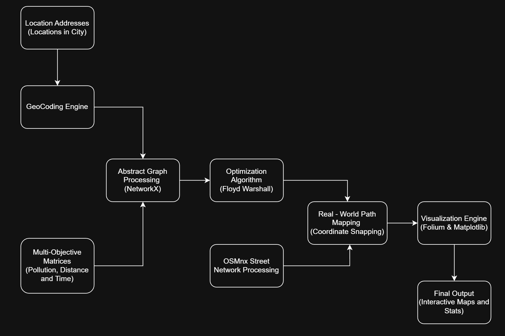

# EcoRoute: Multi-Objective Navigation & Optimization
- EcoRoute is a Python-based navigation tool designed to calculate and visualize optimal paths between multiple locations India, based on three distinct    objectives:  
**Environmental Impact (Pollution), Distance, and Travel Time.**    
- The project leverages graph theory and real-world street network data to provide a comparative analysis of ```"Green," "Shortest," and "Fastest" routes.```  
-------------------------------------------------------------------------------------------------------------------------------------------------------------  
# Multi-Objective Analysis:

- **Green Route:** Focuses on minimizing pollution levels using weighted matrices.

- **Yellow Route:** Optimized for the shortest physical distance.

- **Blue Route:** Optimized for the fastest travel time based on road speeds.
-------------------------------------------------------------------------------------------------------------------------------------------------------------  
# Architecture


-------------------------------------------------------------------------------------------------------------------------------------------------------------  
# Features  
- **Geocoding Integration:** Automatically converts human-readable addresses (Example: "Narela Delhi") into precise geographic coordinates using the Nominatim geocoder.    

- **Graph Theory Implementation:** Uses the Floyd-Warshall algorithm to find the shortest paths between nodes in the adjacency matrices and includes custom logic to detect and resolve negative weight cycles for pollution data.

- **Real-World Mapping:** Projects abstract graph paths onto actual Delhi street networks using OSMnx.

- **Interactive Visualizations:** Generates four distinct interactive HTML maps using Folium, including a master map showing all routes overlaid for comparison.
-------------------------------------------------------------------------------------------------------------------------------------------------------------  
# Requirements
To run this project, you need Python installed along with the following libraries:

   - osmnx: For retrieving and modeling street networks.  
   - networkx: For graph algorithms (Floyd-Warshall, path reconstruction).  
   - folium: For generating interactive web maps.  
   - geopy: For geocoding addresses.  
   - matplotlib & numpy: For matrix handling and static graph visualization.  
-------------------------------------------------------------------------------------------------------------------------------------------------------------  
# Project Structure & Logic
The script follows a structured pipeline to move from raw data to interactive maps:  

1. **Data Input & Geocoding**  
The script defines a list of seven key locations in a City:  
The geopy.geocoders.Nominatim service retrieves the latitude and longitude for each.  
  
2. **Matrix Definition**  
Three weighted adjacency matrices (gmat, lmat, tmat) represent the costs (pollution, distance, time) between these locations.  

3. **Route Calculation**  
Negative Cycle Detection: For the Green route, the script checks for negative cycles. If found, it applies a weight-shifting transformation to ensure the graph can be solved without infinite loops.  

```Floyd-Warshall Algorithm: Calculates the shortest path between the start (index 0) and the end destination (last index) across all three objectives. ```
  
4. **Street Network Mapping**  
   - The script downloads the drive-network graph for Delhi using ox.graph_from_place. It then:  
   - Finds the nearest real-world nodes to your geocoded coordinates.  
   - Calculates the actual street path using networkx.shortest_path.  
   - Summates real-world lengths and travel times to provide accurate statistics.  

# Outputs
The script produces several visual outputs:  
1. **Interactive HTML Maps**  
AllRoutesmap.html: A master map displaying Green, Yellow, and Blue routes simultaneously with markers.  


```bash
GreenRouteMap.html: Detailed view of the least polluted path.
YellowRouteMap.html: Detailed view of the shortest distance path.
BlueRouteMap.html: Detailed view of the fastest time path.
```
2. **Static Graphs**  
The script saves three PNG files (GreenRouteGraph.png, etc.) showing the abstract network topology, edge weights, and the selected path highlighted in the respective color.  


3. **Console Statistics**  
The console outputs the precise distance (in km) and estimated travel time (in minutes) for every calculated route.  
